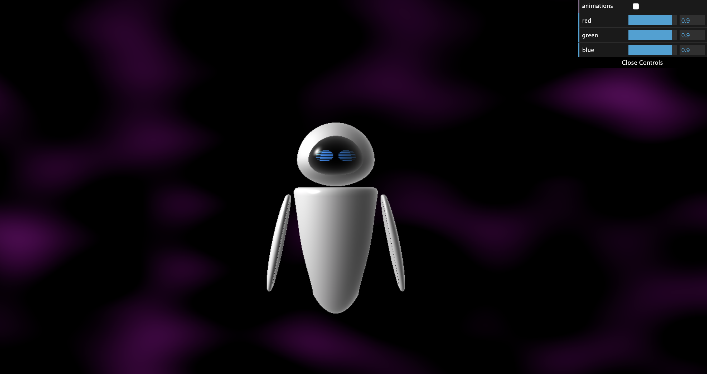
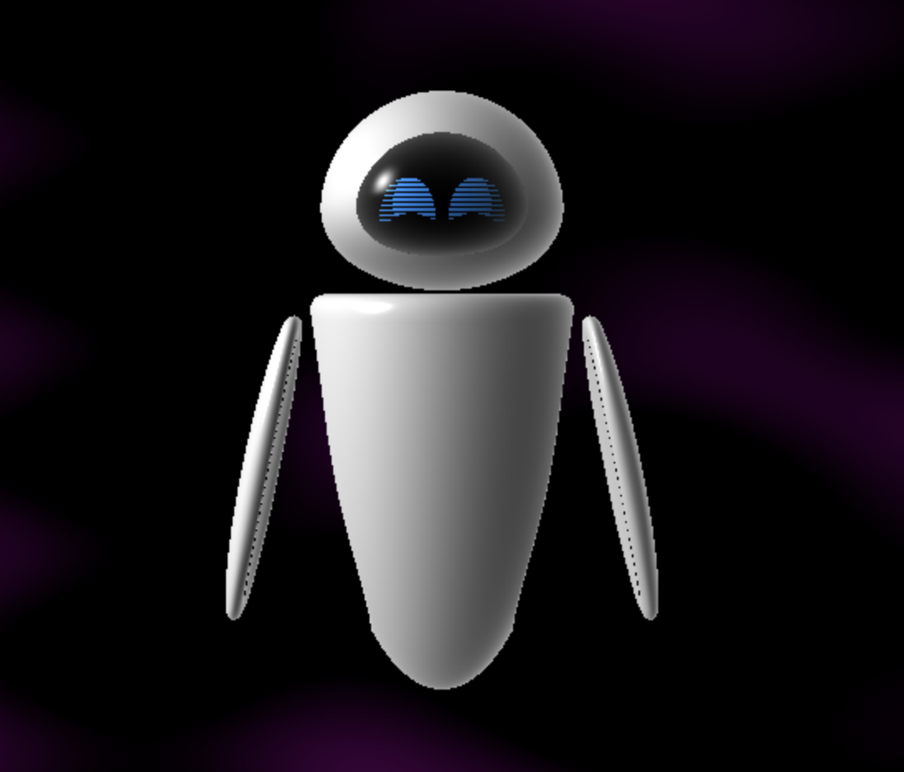
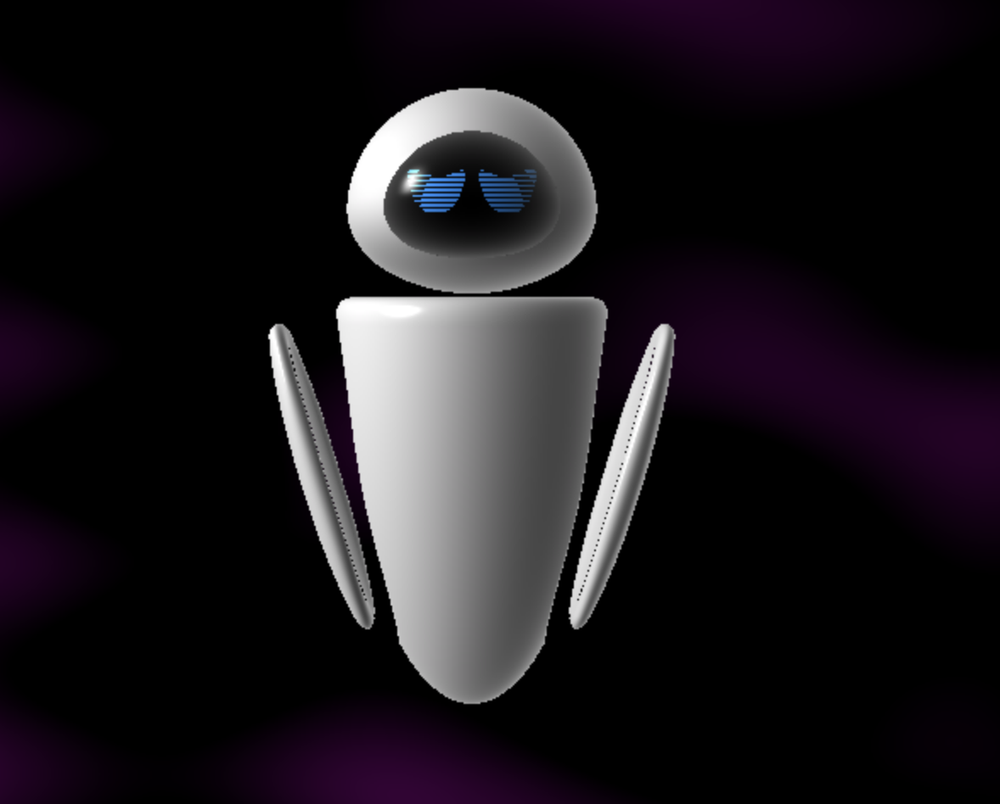
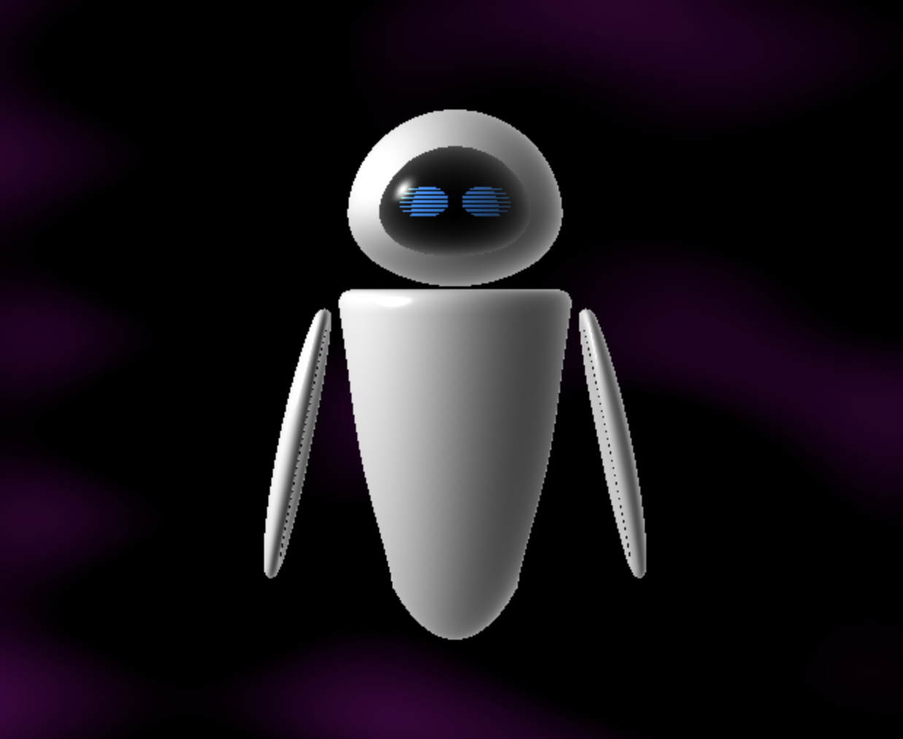
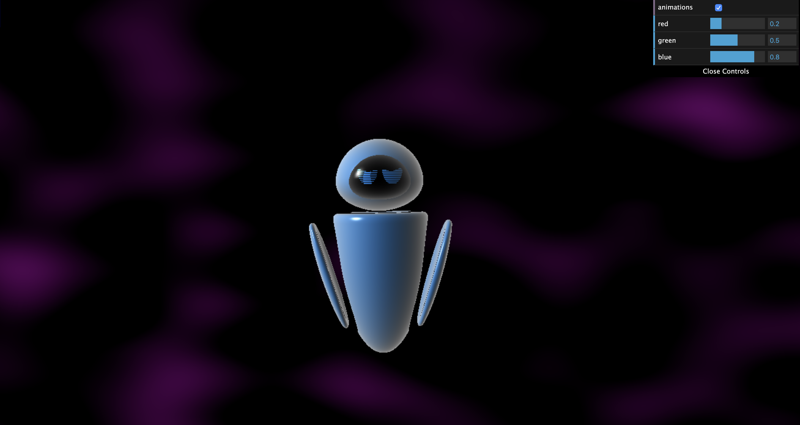

# Implicit Surfaces

Spring 2020  
Iciar Andreu Angulo  
PennKey: iciar  
Demo: https://iciara.github.io/raymarching-sdfs/

## Main Features
For this project I attempted to recreate the character EVE from the movie *WALL-E* using Signed Distance Functions.
- **Geometry**: the geometry was done using a combination of simpler SDF functions, as such spheres, ellipsoids, and cylinders, combined using smooth blend, smooth intersection, and smooth subtraction. In order to improve performance, I created a bounding box around the main parts of the character to use Bounding Volume Hierarchy when ray marching.
- **Shading/Texturing**: the shading of the character takes into account the normals and the light position. The surface is defuse and specular, giving it a glossy look. The colors for the eyes are done using a square wave function to alternate between blue and black. The background is done by combining the black and purple using Perlin noise.
- **Animation**: The animation includes bending of the eye shape to change the expression of the character between happy, normal, and sad. The arms also move at the same speed as the eyes to complete the expression.  
  * **Happy**:  
  
  * **Sad**:
  
  * **Normal**:
  

## GUI Features
- **Animation**: when checked, EVE iterates between the sad, normal, and happy expressions (pictured above). When unchecked, EVE remains in the normal expression.  

- **Color**: the option to change the RGB color of EVE to experiment with different looks. Can change the red, green, and blue values between 0 (black) and 1 (white).

## Resources
- http://www.iquilezles.org/www/articles/distfunctions/distfunctions.htm
- http://www.iquilezles.org/www/articles/smin/smin.htm
- http://www.iquilezles.org/www/articles/functions/functions.htm
- https://www.iquilezles.org/www/articles/sdfbounding/sdfbounding.htm
- https://www.shadertoy.com/view/4scSW4
- https://www.shadertoy.com/view/MsXGWr
